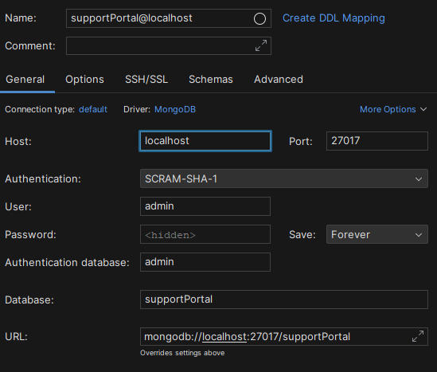

# supportPortal
Anleitung zum Starten des Support Portals

Frontend:
1. In das Verzeichnis `frontend` wechseln
2. `npm install` ausführen
3. `npm run dev` ausführen
4. Frontend ist unter `http://localhost:5173` erreichbar

Backend:
1. In das Verzeichnis `backend` wechseln
2. `npm install` ausführen
3. `npm run watch` ausführen (eigenes script mit nodemon und concurrently oder alternativ `tsc -w` und `node dist/index.js`)
4. Backend ist unter `http://localhost:8080` erreichbar

Datenbank:
1. In das Verzeichnis `backend` wechseln
2. `docker-compose up` ausführen (docker-compose muss installiert sein und der Docker Daemon muss laufen), dies
auf einem Linux oder Mac System ausführen, da das Skript auf Windows nicht funktioniert(mongo-init.js)
3. Datenbank mit einer IDE wie JetBrains DataGrip oder MongoDB Compass öffnen
4. Zugangsdaten sind im Dockercompose File hinterlegt oder hier im Sreenshot zu sehen:  password ist admin
5. Dann die Datenbank Console öffnen und folgenden Befehl ausführen: `use supportPortal`, um die Datenbank zu wechseln und
   `db.createUser({ user: "supportPortal", pwd: "supportPortal", roles: [{ role: "readWrite", db: "supportPortal"}]})` um 
den User anzulegen mit dem das Backend auf die Datenbank zugreift. Sonst wird diese Anwendung nicht funktionieren.

Generell:
1. Dann kann mit einer Registrierung und der Anlage der ersten Tickets begonnen werden, am besten die Rolle Administrator
verwenden zum besten Tests des vollen Funktionsumfangs, siehe für die Logik die beigefügte Dokumentation.
2. Eine Postman Collection ist ebenfalls beigefügt, um die API zu testen. Wichtig ist jedoch, das ein JWT aus dem Login 
oder der Registrierung kopiert wird und in den Headers der anderen Requests eingefügt wird, da die API sonst nicht funktioniert.
3. Wichtig, Passwörter werden in Klartext gespeichert, es werden aber keine Daten die lokale Umgebung verlassen.